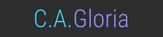

I’m a Software Engineering graduate focused on frontend web development and UI design. I'm currently working on personal projects and improving my skills.

## Where to Find Me

  
  

## My Skills

  
  
  
  
  
  
  
  

